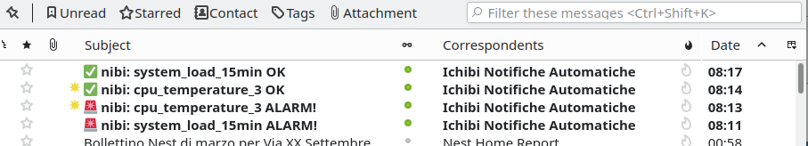
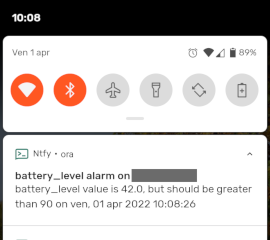
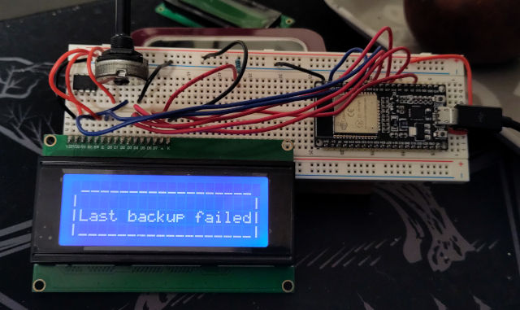

# Selfhost utilities

> This project was moved to [my private git server](https://git.ichibi.eu/penguin86/selfhost-utils) . This repository may not be up to date.

A collection of utilities for self hosters.
Every utility is in a folder with its relevant configuration and is completely separated from the other, so you can install only the ones you need.

## 🚨 HEALTHCHECK

A simple server health check.
Allows to keep under control the machine vitals (cpu usage, raid status, thermals...) and alert the sysadmin in case of anomalies.

Sends an email and/or executes a command in case of alarm (high temperature, RAID disk failed etc...).
As an example, the command may be a ntfy call to obtain a notification on a mobile phone or desktop computer.
Meant to be run with a cron (see healthcheck.cron.example).
Tested on Debian 11, but should run on almost any standard linux box.

Please see [healthcheck documentation](healthcheck/README.md)

## 🖥 MDDCLIENT

A DynDns2 client supporting multiple domains with individual API calls. Developed to allow updating multiple (sub)domains on Infomaniak dynamic DNS, that supports only one domain per request. Works with any provider supporting DynDns2 protocol.

Please see [mddclient documentation](mddclient/README.md)

## 📟 ESP32-LCD

A status LCD for your homelab! Low cost (about 20€ in parts), simple to build (no circuit board, no components, only an LCD, a ESP32 and, if needed, a potentiometer). Connects to your local wifi and receives HTTP requests from your homelab machines, and shows them to the screen.

Please see [ESP32-LCD documentation](esp32-lcd/README.md)

# License
This whole repository is released under GNU General Public License version 3: see http://www.gnu.org/licenses/

# How to contribute

The project is open to contribution, but with some limits:

- I'm sorry I can't accept AI-generated contributions. Reviewing a contribution requires time and effort from my side, while generating code with AI requires very little time and produces non reliable code that must be reviewed in detail. This is effectively shifting the work on my side, and in a forced way. If you feel you need a feature but you're not able to implement it by yourself, I prefer you to create an issue in the repository so I can implement it when I can, in a more mantainable way.
- Before implementing a big change, please contact me to ensure it goes in the project's direction.
- If working on an existing ticket, please name the branch accordingly (feature/ticketNumber, bugfix/ticketNumber...).
- Only issue pull requests to the develop branch, never on the main/master one.

Please see the main repository README file on how to obtain an account to my git instance.

