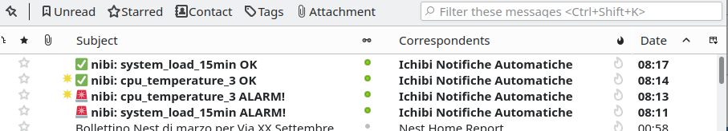
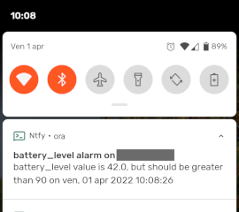

# Selfhost utilities
A collection of utilities for self hosters.
Every utility is in a folder with its relevant configuration and is completely separated from the other, so you can install only the ones you need.

## HEALTHCHECK
A simple server health check.
Allows to keep under control the machine vitals (cpu usage, raid status, thermals...) and alert the sysadmin in case of anomalies.

Sends an email and/or executes a command in case of alarm (high temperature, RAID disk failed etc...).
As an example, the command may be a ntfy call to obtain a notification on a mobile phone or desktop computer.
Meant to be run with a cron (see healthcheck.cron.example).
Tested on Debian 11, but should run on almost any standard linux box.

Please see [healthcheck documentation](healthcheck/README.md)

## MDDCLIENT
A DynDns2 client supporting multiple domains with individual API calls. Developed to allow updating multiple (sub)domains on Infomaniak dynamic DNS, that supports only one domain per request. Works with any provider supporting DynDns2 protocol.

Please see [mddclient documentation](mddclient/README.md)

# License
This whole repository is released under GNU General Public License version 3: see http://www.gnu.org/licenses/
