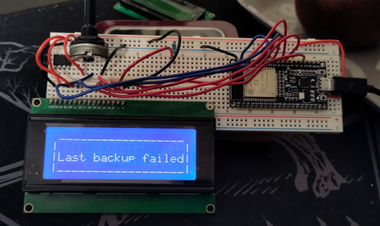

# ESP32-LCD

A status LCD for your homelab.

## BOM

- Any HD44780-based character LCD display, up to 20x4 characters. The most common are 16x2 characters (16 characters per row, 2 rows).
- An ESP-32 board
- A potentiometer, usually a 10 or 100k one, for controlling contrast (a couple of resistances arranged as a voltage divider may also be fine)

## Assembly

Connect the LCD to the board:

**LCD Pin  ->  ESP32 Pin**

- PIN01-VSS -> GND
- PIN02-VDD -> 5V
- PIN03 V0 ->  10K Pot (Middle pin)
- PIN04 RS ->  GPIO19
- PIN05 RW ->  GND
- PIN06  E ->  GPIO23
- PIN07 D0 ->  NOT USED
- PIN08 D1 ->  NOT USED
- PIN09 D2 ->  NOT USED
- PIN10 D3 ->  NOT USED
- PIN11 D4 ->  GPIO18
- PIN12 D5 ->  GPIO17
- PIN13 D6 ->  GPIO16
- PIN14 D7 ->  GPIO15
- PIN15 A  ->  5V
- PIN16 K  ->  GND

Connect the potentiometer lateral pins to VCC and GND. Use the potentiometer to set the screen contrast.

Open config.h file and set display size and your wifi access data.

Flash the code to the ESP32. If you use the Arduino ide to do it, just open the esp32-lcd.ino file with the Arduino ide and follow [this instructions](https://randomnerdtutorials.com/getting-started-with-esp32/)

Restart the ESP32. The display shows "Conn to wifi..." with the WIFI name in the second line (if using a two or more lines display) and then will show the IP address.

## Use

- Turn on the circuit, wait for connection and note down the IP address shown on the screen.
- Make a GET request to the same IP address with a parameter "message" containing some text

> Example: to make the request using CURL from command line, try something along this lines (replace the IP addr with the one shown in the display):
> `curl -G http://192.168.1.78 --data-urlencode "message=Something interesting happened!"`

## Troubleshooting

The ESP32 logs are written in the serial monitor at 115200 baud. Just open the Arduino ide Serial Monitor from Tools menu and look at the logs.

If the screen is supplied with power but not initialized (maybe due to bad contacts or non working esp32 firmware), it should show some black blocks on the first line. If you canot see those (nor any other text), first of all check the contrast using the potentiometer.
