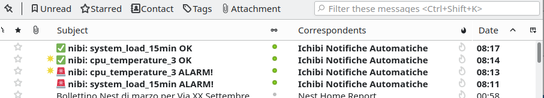
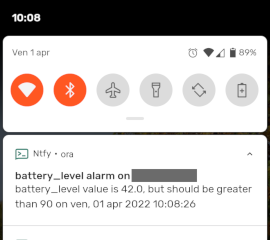

# HEALTHCHECK
A simple server health check.
Allows to keep under control the machine vitals (cpu usage, raid status, thermals...) and alter the sysadmin in case of anomalies.

Sends an email and/or executes a command in case of alarm.
As an example, the command may be a ntfy call to obtain a notification on a mobile phone or desktop computer.
Meant to be run with a cron (see healthcheck.cron.example).
Tested on Debian 11, but should run on almost any standard linux box.

      

## Alarms
Provided ready-to-use alarms in config file:
- cpu load
- disk space
- raid status
- battery level / charger status (for laptops used as servers, apparently common among the self hosters)
- memory status

Alarms that need basic configuration to work on your system:
- cpu temperature (needs to be adapted as every system has a different name for the sensor)
- fan speed (needs to be adapted as every system has a different name for the sensor)

... or you can write your own custom alarm!

## How does it work
The config file contains a list of checks. The most common checks are provided in the config file, but it is possible to configure custom checks, if needed.
Every check definition has:
- DISABLED: boolean, wether to run the check
- ALARM_VALUE_MORE_THAN: float, the alarm is issued if detected value exceeds the configured one
- ALARM_VALUE_LESS_THAN: float, the alarm is issued if detected value is less than the configured one
- ALARM_VALUE_EQUAL: float, the alarm is issued if detected value is equal to the configured one (the values are always compared as floats)
- ALARM_VALUE_NOT_EQUAL: float, the alarm is issued if detected value is not equal to the configured one (the values are always compared as floats)
- ALARM_STRING_EQUAL: string, the alarm is issued if detected value is equal to the configured one (the values are always compared as strings)
- ALARM_STRING_NOT_EQUAL: string, the alarm is issued if detected value is not equal to the configured one (the values are always compared as strings)
- COMMAND: the command to run to obtain the value
- REGEXP: a regular expression that will be executed on the command output and returns a single group that will be compared with ALARM_*. If omitted, the complete command output will be used for comparation.

## Installation
Copy the script and the config file into the system to check:
```
cp healthcheck.py /usr/local/bin/healthcheck.py
cp healthcheck.cfg.example /usr/local/etc/healthcheck.cfg
```
Edit `/usr/local/etc/healthcheck.cfg` enabling the checks you need and configuring email settings.
Run `/usr/local/bin/healthcheck.py /usr/local/etc/healthcheck.cfg` to check it is working. If needed, change the config to make a check fail and see if the notification mail is delivered. If you need to do some testing without spamming emails, run with the parameter `--dry-run`.
Now copy the cron file:
```
cp healthcheck.cron.example /etc/cron.d/healthcheck
```
For increased safety, edit the cron file placing your email address in MAILTO var to be notified in case of healthcheck.py catastrophic failure.

Setup is now complete: the cron runs the script every minute and you will receive emails in case of failed checks.

## Useful notes
### Note on system load averages**:
As stated in the `uptime` command manual:
> System load averages is the average number of processes that are either in a runnable or uninterruptable state.  A process in a runnable state is either using the CPU  or  waiting  to  use the CPU.  A process in uninterruptable state is waiting for some I/O access, eg waiting for disk.  The averages are taken over the three time intervals.  Load averages are not normalized for the number of CPUs in a system, so a load average of 1 means a single CPU system  is  loaded  all  the  time while on a 4 CPU system it means it was idle 75% of the time.

### Note on temperature and fan speed checks:
The check to run needs lm-sensors to be installed and configured. Check your distribution install guide.
The sensors have different name in every system, so you WILL need to adapt the configuration.
Some systems have a single temperature sensors for the whole CPU, while some other has a sensor for every core. In this last case, you may want to copy the `[cpu_temperature]` config in N different configs like `[cpu_temperature_0]`, one for every core, and change the REGEX to match `Core 0`, `Core 1` and so on...
